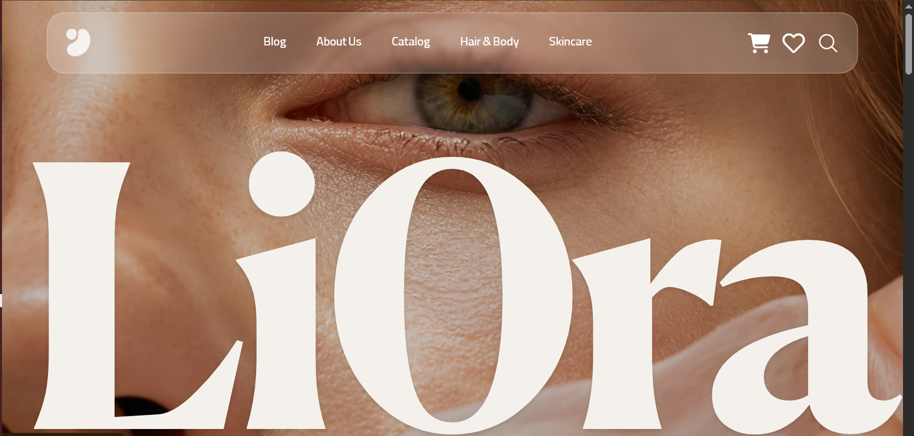

🌿 Liora — فروشگاه محصولات مراقبت پوست و مو
فروشگاه آنلاین کامل با تجربه‌ی خرید یکپارچه: از مرور محصولات و فیلتر پیشرفته تا سبد خرید و تسویه‌حساب با اعتبارسنجی فرم.

🔗 دموی زنده: liora-pearl.vercel.app

✨ امکانات
فروشگاه
🛍️ صفحه‌ی محصولات با فیلتر دسته‌بندی و مرتب‌سازی بر اساس قیمت — همگام با URL (قابل اشتراک‌گذاری و رفرش‌پذیر)
🔍 جستجوی زنده در مودال، بدون درخواست اضافه به سرور (فیلتر روی کش)
❤️ علاقه‌مندی‌ها با پایداری پس از رفرش
🖼️ اسلایدر محصولات با پشتیبانی کامل RTL، ناوبری کیبورد و دسترسی‌پذیری
سبد خرید و خرید
🛒 سبد خرید با Zustand + پایداری در localStorage
🧺 Drawer کشویی: تغییر تعداد، حذف، جمع کل زنده
✅ تسویه‌حساب با اعتبارسنجی فارسی (شماره موبایل و کد پستی با ارقام فارسی هم پذیرفته می‌شوند!)
فنی
⚡ TanStack Query با کش مشترک بین صفحات — مرور دوباره‌ی صفحات بدون لودینگ
💀 Skeleton Loading برای همه‌ی دریافت‌های داده
🎨 UI تمام‌RTL با تایپوگرافی ترکیبی فارسی/انگلیسی
♿ دسترسی‌پذیری: aria-labels، ناوبری کیبورد، احترام به prefers-reduced-motion
📱 موبایل‌فرست واقعی — طراحی از ۳۲۰px تا 4K
🛠️ تکنولوژی‌ها
لایه	ابزار
فریم‌ورک	React 19 + TypeScript
استایل	Tailwind CSS v4 (theme tokens, cascade layers)
روتر	React Router v7 (lazy routes + Suspense)
مدیریت state	Zustand (+ persist middleware)
داده‌ی سرور	TanStack Query v5
فرم	React Hook Form + Zod
انیمیشن	Framer Motion
🚀 اجرا در محیط محلی
# نصبnpm install# اجرای محلیnpm run dev# بیلد برای انتشارnpm run build# بهینه‌سازی تصاویر به WebPnpm run optimize:images
🏗️ نکات معماری
جدا‌سازی لایه‌ها: کامپوننت‌ها به API دسترسی مستقیم ندارند — همه از هوک‌های سفارشی (useProducts) استفاده می‌کنند. مهاجرت به API واقعی فقط تغییر یک فایل است.
URL به‌عنوان منبع حقیقت: فیلترها و مرتب‌سازی در query params زندگی می‌کنند، نه state — نتیجه: لینک قابل اشتراک، سازگاری با دکمه‌ی بازگشت مرورگر.
کش مشترک: همه‌ی صفحاتی که به محصولات نیاز دارند از یک queryKey می‌خوانند؛ نتیجه: ناوبری فوری بین صفحات.
📈 پرفورمنس
تمام تصاویر WebP (~۹۰٪ سبک‌تر از PNG)
فونت‌های WOFF2 با font-display: swap و preload
Code-splitting در سطح صفحه (هر route باندل جدا)
📄 License
MIT
Author / Contact: Nick Soltani, nicksoltaninavid@gamil.com